# NOTE: if you have used my other apps you will need to delete "SavedWorkArray" from local storage before loading this app.
I reused this code because it works.. why not.. only issue is that if your system still has it saved it may load the history list with [object][object]
I didn't notice this until after everything was done and loaded to github.. Defintely something work on in the future..

I had a great time working on this project and it is perfectly in line with our current group project so that is great. I am getting much better at this and love working with the rest of the class. Solving problems together is much easier and we learn from each other when we help teach each other. 

# Project Weather Dashboard APP


- [X] build skeleton html
- [X] Style html so it looks good
- [X] build botton listener for search button
- [X] build function to load search work into local history. check to make sure it doesn't already exist. 
- [X] build local storage save and search load.. ie. when they search it pushes to array and saves
- [X] build last search item on page load. on page load if local is != null load  last element in array
- [X] build icons. requires building urls to images on weather webpage and using them as src=
- [ ] future function, keep track of toggling between search history city and make the last city loaded the one that is loaded when the page is reloaded. not the last one in the array.
- [X] future make first letter of multi work citys be capital. currently only the first letter of the first word gets capitalized.
- [X] switched to zip code search. It returns more accurate location data. Midland Mi returns midland TX no matter what..
- [ ] Save name of zip code search to favorites. A bigger rewrite because of the way the code is. 
- [ ] Add min max temp to 5 day forecast
- [ ] Change 5 day forecast to 7 day forecast
- [ ] History collapse and Hide. This menu can get large if the user adds enought places to save.. 
- [ ] History delete function. need a way to delete specific locations. in addition to deleting the entire list.

- [X] finish read me. this is from the first complete... in maintenance/CI mode
- [X] publish repo

# Project scope and function
as a traveler I need to keep track of the weather and 5 day forecast in as many citys as I want. 
when i reload the page it should load with the last city i searched

# Unique features
- the search citys are checked against the existing array. it will only add it if it is a new city.
- changes the first letter to upper case no matter what.. 
- clear history function. this resets the array to empty.. this was tricky because it is in the same dom as the array elements and in the beginning that caused issues.


# Images are below this line
Mobile updates.\s\s
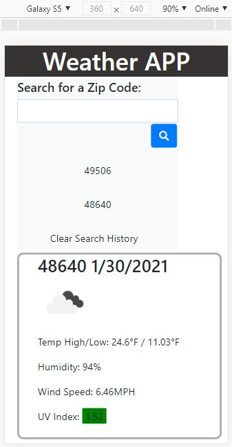

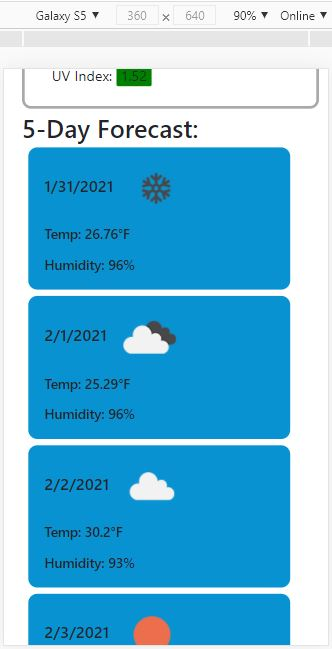

This is the first html content. all hard coded.
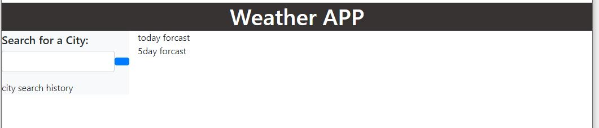

This is the first object returned from the AJAX call to the weather api.
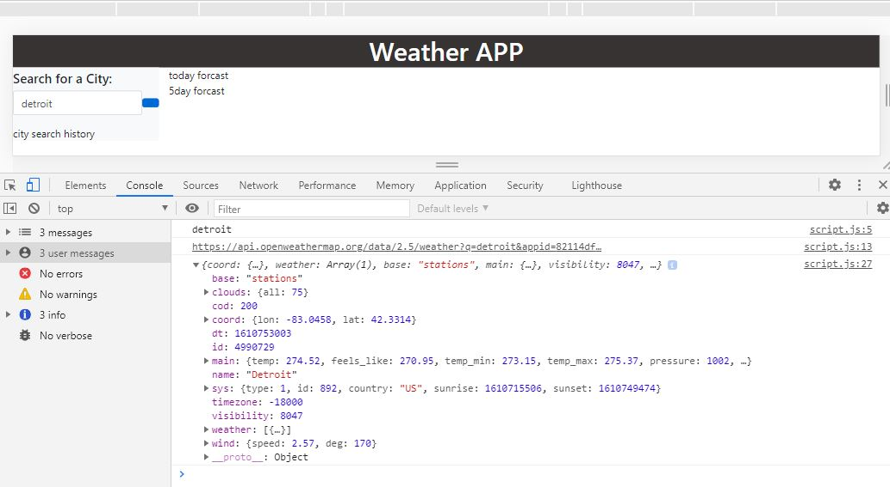

This is the first ONECALL with time converted from unix to normal and outputing the uv index
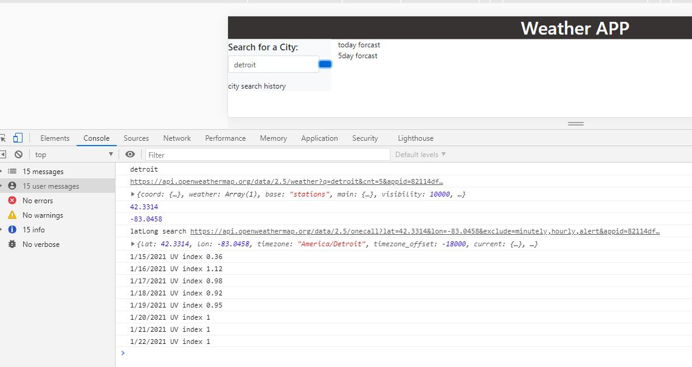

This is the first dynamic render of the current day weather.
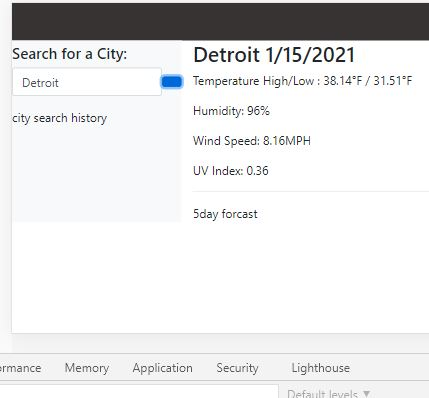

This is the 5 day forecast hard code html before converting it to dynamic render.
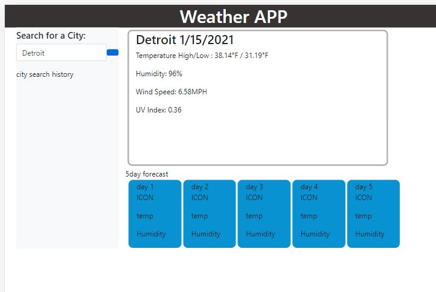

This is the first 5 day forecast dynamic render. icon place holder.
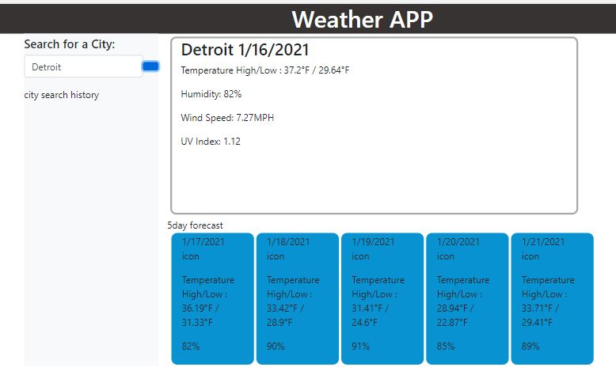

First icons appear.. in the 5 day forecast.. current day comes later.
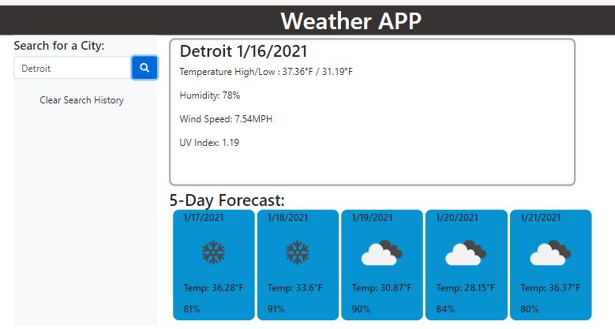

This is the snip i used to determine what colors to use for the uv index background color. weather channel seems legit.
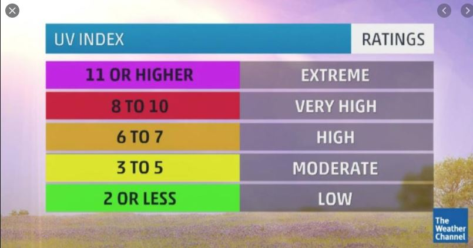

First console log showing uv index logic works. 
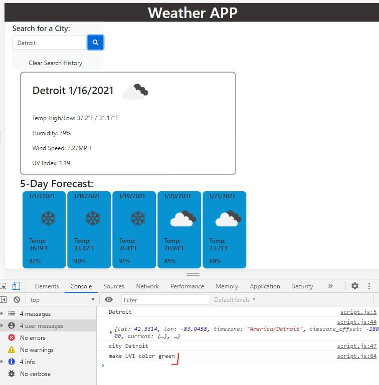

UV index color changes in full effect.. I used cities in florida, michigan, California, etc to check.
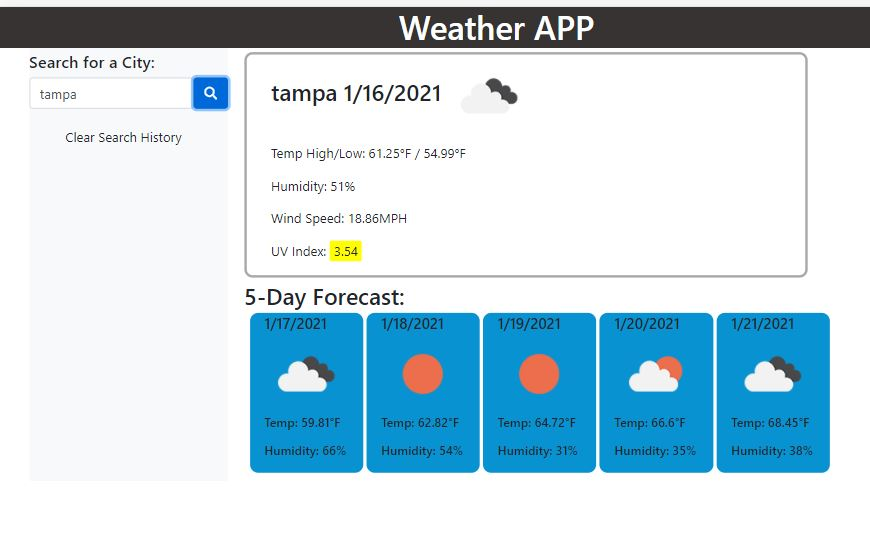

Final images showing it in full function running on github
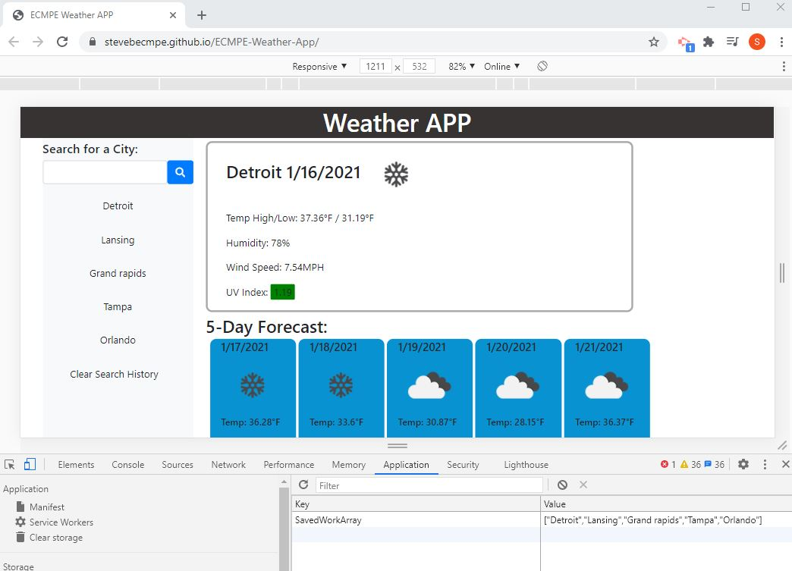


# Given SOW data is below this line-------------------------------

# 06 Server-Side APIs: Weather Dashboard

Developers are often tasked with retrieving data from another application's API and using it in the context of their own. Third-party APIs allow developers to access their data and functionality by making requests with specific parameters to a URL. Your challenge is to build a weather dashboard that will run in the browser and feature dynamically updated HTML and CSS.

Use the [OpenWeather API](https://openweathermap.org/api) to retrieve weather data for cities. The documentation includes a section called "How to start" that will provide basic setup and usage instructions. Use `localStorage` to store any persistent data.

## User Story

```
AS A traveler
I WANT to see the weather outlook for multiple cities
SO THAT I can plan a trip accordingly
```

## Acceptance Criteria

```
GIVEN a weather dashboard with form inputs
WHEN I search for a city
THEN I am presented with current and future conditions for that city and that city is added to the search history
WHEN I view current weather conditions for that city
THEN I am presented with the city name, the date, an icon representation of weather conditions, the temperature, the humidity, the wind speed, and the UV index
WHEN I view the UV index
THEN I am presented with a color that indicates whether the conditions are favorable, moderate, or severe
WHEN I view future weather conditions for that city
THEN I am presented with a 5-day forecast that displays the date, an icon representation of weather conditions, the temperature, and the humidity
WHEN I click on a city in the search history
THEN I am again presented with current and future conditions for that city
WHEN I open the weather dashboard
THEN I am presented with the last searched city forecast
```

The following image demonstrates the application functionality:


## Review

You are required to submit the following for review:

* The URL of the deployed application.

* The URL of the GitHub repository. Give the repository a unique name and include a README describing the project.

- - -
© 2019 Trilogy Education Services, a 2U, Inc. brand. All Rights Reserved.
